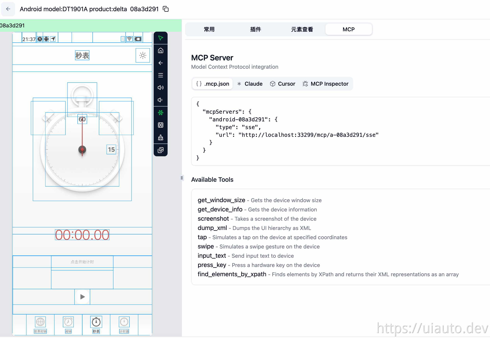

# uiautodev

UI 自动化 · 设备管理 · AI 工具箱

## 简介

uiautodev 是一款集 UI 自动化、设备管理和 AI 工具于一体的桌面应用，旨在提升开发和测试效率。

## 下载

编译后的安装包可从以下地址下载：

[https://get.uiauto.dev](https://get.uiauto.dev)

## 反馈

如有问题或功能需求，请在 [Issues](https://github.com/uiautodev/uiautodev/issues) 中提交。

## 开源说明

本项目为闭源开发，源码未托管于此仓库。但项目所依赖的多个核心库已开源，[开源地址](https://github.com/uiautodev) 欢迎关注。
