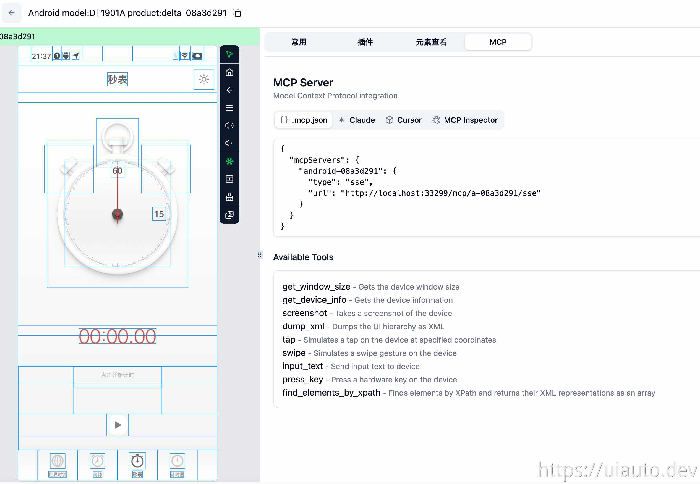

> **中文文档：** [README_CN.md](README_CN.md)

## Introduction

[](https://www.npmjs.com/package/uiautodev)

uiautodev is a tool focused on **mobile device control, automation, and remote real devices**. It comes in two forms: a desktop app and a server. It supports Android, iOS, and HarmonyOS, helping developers and testers efficiently handle device management and UI automation.



## Quick Start

No installation required. Copy and run the command below (it will automatically download the server binary for your platform on first run):

```bash
npx uiautodev
```

After startup, the server listens on `http://127.0.0.1:33299` by default.

## CLI

| Command / Flag | Description |
|---|---|
| `run` | Download (if needed) and run the server binary (default command); extra args are passed through as-is |
| `download` | Only download; print the binary path |
| `path` | Only print the binary path; do not download |
| `--version <v>` | Specify a version (default: latest) |
| `--force` | Ignore cache and force re-download |
| `--debug` | Output debug logs (equivalent to `DEBUG=uiautodev:*`, e.g. request/response for download stats POST) |
| `--help` | Show help |

The binary is cached at `~/.cache/uiautodev/<version>/`. Override with the `UIAUTODEV_CACHE_DIR` environment variable.

```bash
npx uiautodev                       # download the latest server and run it
npx uiautodev run -addr :8000       # run and pass through args (listen on :8000)
npx uiautodev --version 0.6.0 run   # specify a version
npx uiautodev download              # only download; print the binary path
npx uiautodev download --force      # force re-download
npx uiautodev path                  # only print the binary path; do not download
npx uiautodev --debug download      # debug mode: view request/response for download stats POST
DEBUG=uiautodev:* npx uiautodev download   # same as above, enable debug logging via env var
```

> Note: `run` passes all arguments after the subcommand through to the server binary as-is, so global options like `--debug` and `--force` must be placed before the subcommand (e.g. `npx uiautodev --debug run`).

## Download

Prebuilt packages can be downloaded from:

[https://get.uiauto.dev](https://get.uiauto.dev)

## Documentation

https://www.yuque.com/codeskyblue/uiautodev

## Feedback

For issues or feature requests, please file them in [Issues](https://github.com/uiautodev/uiautodev/issues).

## Related Projects

- [dictlog](https://github.com/uiautodev/dictlog) A structured Python logging library, compatible with the standard `logging` module
- [uiautoagent](https://github.com/uiautodev/uiautoagent) Use AI to control your phone to complete tasks
