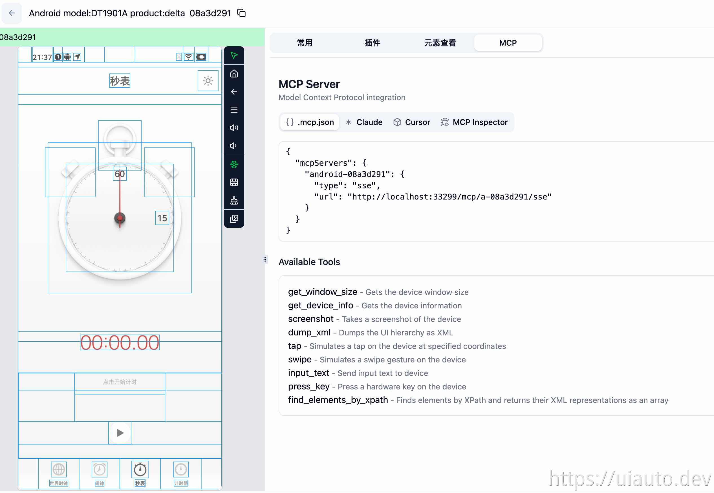

> **English version:** [README.md](README.md)

## 简介

[](https://www.npmjs.com/package/uiautodev)

uiautodev 是专注于**移动端控制、自动化与远程真机**的工具，提供桌面应用与服务端两种形态，支持 Android、iOS、鸿蒙（HarmonyOS），帮助开发和测试高效完成设备管理与 UI 自动化。



## 快速开始

无需安装，复制下面的命令即可运行（首次会自动下载对应平台的服务端二进制）：

```bash
npx uiautodev
```

启动后服务端默认监听 `http://127.0.0.1:33299`。

## CLI

| 命令 / 参数 | 说明 |
|---|---|
| `run` | 下载（如需）并运行服务端二进制（默认命令），之后参数原样透传 |
| `download` | 仅下载，打印二进制路径 |
| `--version <v>` | 指定版本（默认最新） |
| `--force` | 忽略缓存，强制重新下载 |
| `--help` | 显示帮助 |

二进制缓存于 `~/.cache/uiautodev/<version>/`，可用环境变量 `UIAUTODEV_CACHE_DIR` 覆盖。

```bash
npx uiautodev                       # 下载最新版服务端并运行
npx uiautodev run -addr :8000       # 运行并透传参数（监听 :8000）
npx uiautodev --version 0.6.0 run   # 指定版本
npx uiautodev download              # 仅下载，打印二进制路径
npx uiautodev download --force      # 强制重新下载
```

## 下载

编译后的安装包可从以下地址下载：

[https://get.uiauto.dev](https://get.uiauto.dev)

## Agent Skill：device-control

本项目提供 `device-control` skill，让 AI 通过 uiautodev MCP 控制移动设备 UI（点击 / 截图 / 滑动 / 输入文字 / 按键等）。使用 [skills.sh](https://skills.sh) CLI 安装：

```bash
npx skills add uiautodev/uiautodev --skill device-control
```

常用参数：

| 参数 | 说明 |
|---|---|
| `-g` | 全局安装（`~/.claude/skills/`、`~/.agents/skills/` 等） |
| `-a <agent>` | 只装到指定客户端，如 `-a claude-code`、`-a opencode` |
| `-y` | 跳过交互确认，适合 CI |

安装后在 agent 中配置好 uiautodev MCP server，即可让模型自动触发该 skill 完成真机操作。

## 文档

https://www.yuque.com/codeskyblue/uiautodev

## 反馈

如有问题或功能需求，请在 [Issues](https://github.com/uiautodev/uiautodev/issues) 中提交。

## 开源说明

本项目为闭源开发，源码未托管于此仓库。但项目所依赖的多个核心库已开源，[开源地址](https://github.com/uiautodev) 欢迎关注。

- [dictlog](https://github.com/uiautodev/dictlog) 结构化的python日志库，兼容标准库logging
- [uiautoagent](https://github.com/uiautodev/uiautoagent) 使用ai控制手机完成任务
